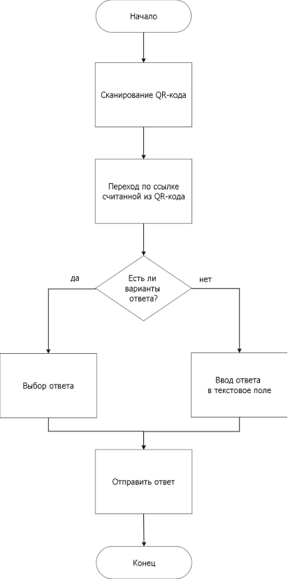

**Содержание**

[Обозначения и сокращения](#_djmk8xy2d1vp)[	6](#_djmk8xy2d1vp)

[1](#_vb4tjbdliqy0)[Анализ технического задания и предметной области. Обзор аналогов	9](#_vb4tjbdliqy0)

[1.1](#_vb4tjbdliqy0)[Анализ технического задания	9](#_vb4tjbdliqy0)

[1.2](#_ah25rsla22mk)[Аналоги	10](#_ah25rsla22mk)

[1.3 Обзор используемых технологий и программных средств](#_kxsl2py3btoy)[	11](#_kxsl2py3btoy)

[2](#_4wot7z7tg3k2)[Описание базы данных	14](#_4wot7z7tg3k2)

[3    Описание разработанного программного обеспечения](#_5biah96k948r)[	18](#_5biah96k948r)

[3.1](#_5biah96k948r)[Описание архитектуры приложения	18](#_5biah96k948r)

[3.2](#_q5xzw7oesce0)[Описание структуры веб-приложения	23](#_q5xzw7oesce0)

[3.3](#_8ate2g30aq6v)[Описание основных алгоритмов	24](#_8ate2g30aq6v)

[3.4](#_nw6lu7oj127u)[Описание основных функций	29](#_nw6lu7oj127u)

[4](#_o8hfhvblvyk6)[Описание пользовательского интерфейса	32](#_o8hfhvblvyk6)

[Заключение](#_bztxqnbphb11)[	39](#_bztxqnbphb11)

[Список используемой литературы](#_nv3lln357k4)[	40](#_nv3lln357k4)

**Обозначения и сокращения**

БД – база данных.

СУБД – система управления базами данных.

UML – от англ. Unified Modeling Language (унифицированный язык моделирования). 

QR – от англ. Quick Response code («код быстрого отклика»; сокр. QR code). 

JS – JavaScript.

CRUD – Create Read Update Delete.

AJAX – Asynchronous JavaScript and XML.

**Введение**

В последние десятилетия образование претерпевает значительные изменения вызванные стремительным развитием технологий изменением подходов к обучению. Современное образование активно интегрирует цифровые технологии для повышения эффективности обучения. Одной из ключевых задач является вовлечение слушателей в ходе лекции и оперативная проверка усвоения материала. Традиционные методы, такие как устные опросы или письменные задания, не всегда позволяют быстро получить обратную связь от всей аудитории, особенно в больших группах.

Разрабатываемое веб-приложение решает эту проблему, предлагая интерактивный инструмент для проведения мгновенных опросов во время лекции с использованием  QR-кодов. QR-код — это двумерный штрихкод, который легко считывается смартфонами и другими устройствами. Благодаря своей структуре он хранит информацию по горизонтали и по вертикали, что позволяет разместить больше данных на меньшей площади в сравнении с линейным штрихкодом [1].

Это позволяет:

1. Повысить вовлеченность аудитории – интерактивные элементы делают процесс обучения более динамичным и интересным.
1. Обеспечить оперативную обратную связь – лектор может сразу оценить уровень понимания материала и при необходимости скорректировать подачу информации.
1. Упростить процесс контроля знаний – автоматизация сбора ответов сокращает время на проверку и анализ результатов.
1. Минимизировать зависимость от сторонних сервисов – собственное решение исключает риски, связанные с ограничениями внешних платформ (платность, доступность).

Разработка специализированного веб-приложения, учитывающего потребности лекторов и слушателей, способствует совершенствованию учебного процессам и соответствует современным тенденциям цифровизации образования.

Таким образом, данная работа имеет практическую ценность, так как предлагает удобное и эффективное решение для интерактивного обучения, применимое в образовательных учреждениях различного уровня [2].

Для реализации требований в рамках ВКР были поставлены следующие задачи:

1. Анализ существующих решений.
1. Обоснование актуальности разработки и выбора используемых технологий и программных средств.
1. Описание разработанных моделей, алгоритмов, программного обеспечения, пользовательского интерфейса.
1. Схемы БД и основных алгоритмов или диаграмм UML, описывающее разработанное приложение.
1. Исходный код и примеры работы веб-приложения.

UML — язык графического описания для объектного моделирования в области разработки программного обеспечения, для моделирования бизнес-процессов, системного проектирования и отображения организационных структур [3].

1. **Анализ технического задания и предметной области. Обзор аналогов**
   1. **Анализ технического задания**

`	`Разрабатываемое веб-приложение  для создания интерактивных лекций представляет из себя современный инструмент, направленный на повышение качества образовательного процесса. Оно поможет организовать удобное и оперативное взаимодействие между лектором и аудиторией.

`	`Веб-приложение для создания интерактивных лекций должно удовлетворять следующим требованиям:

1. Система должна позволять преподавателям создавать опросы с различными типами вопросов и возможностью добавлять, удалять, редактировать их.
1. После создания опроса преподавателем, система должна генерировать уникальный QR-код, который преподаватель сможет скачать и продемонстрировать аудитории, что упрощает доступ слушателей к опросу без необходимости ввода длинных URL-адресов.
1. Лектор должен иметь возможность просматривать список созданных опросов и удалять уже имеющиеся опросы.
1. Система должна позволять аудитории сканировать QR-коды и получать доступ к соответствующему опросу через уникальный URL.
1. Слушатели должны иметь возможность вводить и отправлять свои ответы на опрос.
1. Система должна позволять просматривать лекторам статистику и результаты  опросов.

С технической точки зрения, приложение потребует реализации серверной части для хранения и обработки данных, а также клиентской части с адаптивным дизайном для различных устройств. Так же важно обеспечить безопасность данных, защищая систему от несанкционированного доступа.

Таким образом, разработка данного веб-приложения позволит повысить эффективность проведения лекционных занятий, улучшить взаимодействие между лектором и аудиторией, осуществлять контроль текущих знаний, повысить вовлеченность слушателей.

1. **Аналоги**

В качестве аналогов выбраны веб-приложения, которые предоставляют возможность создания интерактивных лекций. Рассмотрим существующие системы, используемые преподавателями и студентами, лекторами и слушателями (таблица 1).

Таблица 1 – Сравнение с аналогами

|Характеристика|Google Forms [4]|SurveyMonkey [5]|h5p.org [6]|Разработанное веб-приложение|
| :-: | :-: | :-: | :-: | :-: |
|Генерация QR-кодов|Отсутствует встроенная функция генерации|Отсутствует встроенная функция генерации|Отсутствует встроенная функция генерации|Реализована встроенная функция автоматической генерации|
|Простота использования|Интуитивно понятный интерфейс, простота ввода в эксплуатацию|Недружественный интерфейс, требует времени для чтобы разобраться в системе и внедрить её|Недружественный интерфейс, требует времени для чтобы разобраться в системе и внедрить её|Интуитивно понятный интерфейс, простота ввода в эксплуатацию|
|Поддержка различных типов вопросов|Присутствует|Присутствует|Присутствует|Присутствует|
|Бесплатное использование|Полностью бесплатное распространение|Частично платный доступ|Бесплатный пробный период, далее - платная подписка|Полностью бесплатное распространение|
|Доступность на территории РФ|Доступен на территории РФ|Доступ на территории РФ ограничен|Доступен на территории РФ|Доступен на территории РФ|

В результате анализа существующих систем был сделан вывод о необходимости разработки собственного решения, так как существующие аналоги являются универсальными решениями и имеют ряд существенных недостатков при их использовании в процессе обучения. Для создания интерактивных лекций предлагается разработать веб-приложение, которое будет соответствовать специфическим требованиям лекторов и аудитории, а также устранит проблемы, возникающие из-за ограничений при использовании сторонних сервисов.

Разработанное веб-приложение позволит проводить во время лекции опросы аудитории, например, для контроля усвоения материала, излагавшегося на предыдущих лекциях. Для этого лектор должен заранее подготовить в веб-приложении вопросы с вариантами ответов. Для каждого вопроса приложение сгенерирует уникальный QR-код. Во время чтения лектор будет демонстрировать презентацию, на слайдах которой он может поместить контрольные вопросы и сгенерированные веб-приложением QR-коды. Эти QR-коды будут содержать гиперссылки на страницы веб-приложения, где будут приведены варианты ответов на соответствующие вопросы.

**1.3 Обзор используемых технологий и программных средств**

Используемые языки разметки программирования:

1\. HTML (от [англ.](https://ru.wikipedia.org/wiki/%D0%90%D0%BD%D0%B3%D0%BB%D0%B8%D0%B9%D1%81%D0%BA%D0%B8%D0%B9_%D1%8F%D0%B7%D1%8B%D0%BA) HyperText Markup Language — «язык гипертекстовой разметки») — стандартизированный язык гипертекстовой разметки документов для просмотра веб-страниц в браузере. Веб – браузеры получают HTML документ от сервера по протоколам HTTP/HTTPS или открывают с локального диска, далее интерпретируют код в интерфейс, который будет отображаться на экране монитора [7].

2\. CSS (Cascading Style Sheets) — это язык стилей, используемый для описания внешнего вида HTML-документов. С его помощью можно задавать цвета, шрифты, отступы, выравнивание и другие визуальные параметры элементов на веб-странице. CSS делает веб-страницы более привлекательными и удобными для пользователей.

PHP [8].

3\. JavaScript — это интерпретируемый и мультипарадигменный язык программирования. JavaScript отвечает за функциональные возможности и интерактивность соответствующего интерфейса.

Рассматриваемый язык программирования решает самые разные задачи:

1. Взаимодействие с пользователями. Сюда можно отнести всплывающие окна с полями для ввода данных, уведомления об использовании cookie-файлов.
1. Обработка HTML-данных. JavaScript позволяет заполнять необходимые поля в формах, проверить буквенные и числовые значения, управлять HTML-компонентами на сайте.
1. Анимация. Сюда относятся не только движущиеся объекты на странице и кнопки, но и карусель в галереях, плавная прокрутка сайта.
1. Математические расчеты. С помощью JS-скриптов на веб-страницах реализованы всевозможные калькуляторы. Примером может выступать подсчет стоимости товаров в корзине интернет-магазина.
1. Мобильные приложения. При помощи разнообразных фреймворков рассматриваемый инструмент программирования может быть использован для создания кроссплатформенных мобильных проектов.
1. Обработка событий. JS используется для обработки разнообразных событий вроде кликов мыши, нажатия клавиш, отправки формы и иных пользовательских действий. За счет такой особенности удается создавать отзывчивые и реактивные интерфейсы [9].

4\. PHP (Hypertext Preprocessor) — это популярный серверный язык программирования, который используется для создания динамических веб-страниц и веб-приложений. PHP позволяет разработчикам встраивать код прямо в HTML, что упрощает процесс создания интерактивных и функциональных веб-сайтов. Основное преимущество PHP заключается в его простоте и гибкости, что делает его идеальным выбором для начинающих программистов [15].

Так же стоит отметить, что для страницы результатов опроса была использована технология AJAX. AJAX (Asynchronous JavaScript and XML) — мощный инструмент разработки динамичных и производительных интерактивных веб-приложений. AJAX меняет подход к обновлению содержимого страниц и позволяет загружать данные в асинхронном режиме без перезагрузки. Благодаря этой технологии сохраняется высокая скорость загрузки, юзерам удобнее пользоваться сайтами [10].

Используемая среда разработки:

Visual Studio Code (или VS Code) от Microsoft — это удобный текстовый редактор для разработчиков, который работает на Windows, macOS и Linux. Инструмент поддерживает множество языков программирования от JavaScript до Python и предлагает широкий функционал для написания, отладки и тестирования кода. С помощью VS Code можно настраивать среду разработки под индивидуальные задачи, используя расширения и встроенные инструменты [11].

Используемое программное обеспечение:

1\. XAMPP — бесплатный кроссплатформенный дистрибутив для сборки локального веб-сервера. Содержит Apache, MariaDB, язык программирования Perl, интерпретатор скриптов PHP и дополнительные библиотеки. Имеет открытый исходный код, простой в установке и использовании [12].

2\. MySQL Workbench — универсальный инструмент для работы и управления базами данных. С его помощью можно создавать и редактировать таблицы и другие объекты, управлять доступом пользователей и администрировать БД. Workbench полезен для разработчиков, архитекторов систем и администраторов баз данных. Одна из главных особенностей Workbench — визуальное моделирование. Оно позволяет увидеть все таблицы и связи между ними в наглядном виде, что сильно упрощает проектирование БД [13].

3\. PhpMyAdmin — это бесплатный программный инструмент, написанный на PHP и предназначенный для администрирования MySQL через Интернет. phpMyAdmin поддерживает широкий спектр операций с MySQL и MariaDB. Часто используемые операции (управление базами данных, таблицами, столбцами, связями, индексами, пользователями, разрешениями и т. д.) можно выполнять через пользовательский интерфейс, при этом у вас по-прежнему есть возможность напрямую выполнять любой оператор SQL [16].

1. **Проектирование базы данных**

Проектирование базы данных является одним из важных аспектов при разработке веб-приложения, от которого зависит его производительность и удобство дальнейшей поддержки. При проектировании выделяют три основных уровня: концептуальный, логический и физический. 

На рисунке 1 представлен концептуальный уровень проектирования базы данных. Концептуальная модель данных — это абстрактное представление данных организации на высоком уровне. Он фокусируется на сборе сущностей, их атрибутов и отношений без указания каких-либо деталей реализации. Основная цель концептуального моделирования данных — четко понять бизнес-требования и облегчить общение между заинтересованными сторонами, такими как бизнес-аналитики, разработчики и конечные пользователи [11].

На рисунке 2 представлен логический уровень проектирования базы данных. Логическая модель данных — это усовершенствованная модель концептуальной модели данных, в которой сущности, атрибуты и связи дополнительно детализированы и организованы. На этом этапе определяются дополнительные ограничения и правила, а элементы данных организуются в таблицы и столбцы. Логическая модель данных является основой физической модели данных, которая фокусируется на фактических деталях реализации в конкретной СУБД [11].

На рисунке 3 представлен физический уровень проектирования базы данных. Физическая модель данных является заключительным шагом в процессе моделирования данных и представляет фактические детали реализации в конкретной СУБД. Он включает технические спецификации, необходимые для создания структуры базы данных, такие как имена таблиц и столбцов, требования к хранению и типы индексов. Моделирование физических данных направлено на оптимизацию производительности операций с базой данных с учетом особенностей и характеристик выбранной СУБД [11].

Таким образом, был обеспечен плавный переход от абстрактного представления данных к их физической реализации в выбранной СУБД.

          

Рисунок 1 - Концептуальный уровень БД

Рисунок 2 - Логический уровень БД

Рисунок 3 - Физический уровень БД

База данных lecture\_app содержит в себе информацию, необходимую для функционирования веб-приложения интерактивных лекций. Рассмотрим подробнее каждую из таблиц, являющихся основой базы данных:

teachers (таблица 2) – содержит в себе информацию обо всех пользователях, имеющих доступ к системе, поэтому она является фундаментальной. Каждая запись в таблице имеет уникальный идентификатор пользователя, который является первичным ключом и позволяет однозначно идентифицировать его. Так же в таблице хранятся персональные данные пользователя и данные для входа в систему, причем пароль хранится в зашифрованном виде, что соответствует современным стандартам безопасности.

Таблица 2 -  Описание атрибутов teachers

|Имя атрибута|Назначение|Первичный ключ|Внешний ключ|
| :- | :- | :- | :- |
|id|Идентификатор лектора|PK|-|
|surname|Фамилия|-|-|
|name|Имя|-|-|
|login|Логин|-|-|
|password|Пароль|-|-|
|token|Токен|-|-|

quizzes (таблица 3) – хранит все созданные в системе опросы. Уникальный идентификатор однозначно определяет каждый опрос. Поле teacher\_id является внешним ключом и соединяет каждый опрос с его создателем из таблицы teachers, что соблюдает важное правило: каждый опрос должен имеет автора. Поле title позволяет пользователям дать свое название опросу, а created\_at отображает дату создания.

Таблица 3 - Описание атрибутов quizzes

|Имя атрибута|Назначение|Первичный ключ|Внешний ключ|
| :- | :- | :- | :- |
|id|Идентификатор опроса|PK|-|
|teacher\_id|Идентификатор лектора|-|FK|
|title|Название|-|-|
|created\_at|Дата создания|-|-|

questions (таблица 4) – в данной таблице хранятся все вопросы. Первичный ключ id опеределяет уникальный идентификатор для каждого вопроса. Внешний ключ quiz\_id привязывает вопрос к определенному опросу из таблицы quizzes. Поле  question\_text содержит формулировку вопроса, которую впоследствии будут видеть участники. Поле qr\_code\_path содержит путь к сгенерированному qr-коду, содержащему ссылку к соответствующему вопросу. Поле type определяет тип вопроса, что влияет на логику обработки ответов.

Таблица 4 - Описание атрибутов questions

|Имя атрибута|Назначение|Первичный ключ|Внешний ключ|
| :- | :- | :- | :- |
|id|Идентификатор вопроса|PK|-|
|quiz\_id|Идентификатор опроса|-|FK|
|question\_text|Текст вопроса|-|-|
|qr\_code\_path|Путь к QR-коду|-|-|
|type|Тип вопроса|-|-|

	answers (таблица 5) – хранит ответы участником на вопросы с выбором варианта. Первичный ключ id обеспечивает уникальность каждой записи. Внешний ключ question\_id связывает ответ с поставленным вопросом, а option\_id – с вариантом ответа. Поле answered\_at хранит в себе время ответа.

Таблица 5 - Описание атрибутов answers

|Имя атрибута|Назначение|Первичный ключ|Внешний ключ|
| :- | :- | :- | :- |
|id|Идентификатор ответа|PK|-|
|question\_id|Идентификатор вопроca|-|FK|
|option\_id|Идентификатор варианта ответа|-|FK|
|answered\_at|Время ответа|-|-|

options (таблица 6) – содержит возможные варианты ответов на каждый вопрос соответствующего типа. Первичный ключ id обеспечивает уникальность каждой записи. Внешний ключ question\_id связывает варианты ответа с определенными вопросами из таблицы questions. Поле option\_text содержит текст варианта, отображаемый участникам. Поле is\_correct является флагом, указывающим на то, является ли данный вариант правильным ответом или нет.

Таблица 6 - Описание атрибутов options

|Имя атрибута|Назначение|Первичный ключ|Внешний ключ|
| :- | :- | :- | :- |
|id|Идентификатор ответа|PK|-|
|question\_id|Идентификатор вопроca|-|FK|
|option\_text|Текст ответа|-|-|
|is\_correct|Корректность ответа|-|-|

	open\_answer (таблица 7) – хранит ответы участников на вопросы открытого типа. Первичный ключ id обеспечивает уникальность записи. Внешний ключ question\_id связывает ответ с конкретным вопросом из таблицы questions. Поле ansered\_text содержит текст ответа, который дал участник, а answered\_at – время ответа.

Таблица 7 - Описание атрибутов open\_answer

|Имя атрибута|Назначение|Первичный ключ|Внешний ключ|
| :- | :- | :- | :- |
|id|Идентификатор ответа|PK|-|
|question\_id|Идентификатор вопроca|-|FK|
|answer\_text|Текст ответа|-|-|
|answered\_at|Время ответа|-|-|

В результате трехэтапного проектирования базы данных была обеспечена четкая структура для реализации системы интерактивных лекций. 

**3 Описание разработанного программного обеспечения**

1. **Описание архитектуры приложения**

Разработанное веб-приложение использует классическую клиент-серверную архитектуру. Для наглядности работы приложения создана UML диаграмма развертывания, представленная на рисунке 4. 

Рисунок 4 – Архитектура разработанного веб-приложения

В качестве клиентской части (frontend) выступает браузер, который формирует HTTP-запросы, обрабатывает ответы и обеспечивает интерфейс взаимодействия с пользователем. Серверная часть (backend) реализована с помощью связки Apache и MySQL, где Apache принимает и обрабатывает входящие подключения и запросы, а MySQL – хранит структурированные данные и выполняет CRUD операции по запросам сервера.

Диаграмма прецедентов (диаграмма вариантов использования), представленная на рисунке 5, наглядно демонстрирует разделение функционала между пользователями системы и основные сценарии их взаимодействия с приложением. 

Рисунок 5 – Диаграмма прецедентов разработанного веб-приложения

Из диаграммы видно, что в системе предусмотрено четкое разделение прав между пользователями: лектор может зарегистрироваться и получить полный доступ к основному функционалу, тогда как слушатели ограничены возможностью участвовать в опросе без необходимости авторизации. Основной акцент поставлен на взаимодействии лектора с системой: создание, редактирование и удаление вопросов и ответов, анализ результатов. Для слушателей предусмотрен доступ через предоставленный QR – код.

Веб-приложение предусматривает два основных типа пользователей:

`	`1. Лектор – имеет возможность зарегистрироваться в системе, войти в нее и восстановить забытый пароль, после успешной авторизации система предоставляет доступ к созданию, редактированию и удалению опросов, а так же к просмотру результатов.

`	`2. Слушатель – имеет возможность сканировать предоставляемый лектором QR-код и, переходя по содержащейся в нем ссылке, участвовать в опросе и отправлять свои ответы. 

На рисунке 6 представлена диаграмма последовательности «Регистрация».

Последовательность действий при регистрации:

1. Пользователь заполняет свои данные и отправляет их через форму регистрации на сервер.
1. Полученные данные  проходят валидацию на сервере.
1. При успешной валидации сервер сравнивает данные с имеющимися данными в БД на уникальность, иначе возвращает ошибки валидации.
1. После успешного прохождения проверки пароль хешируется и в БД добавляется новый пользователь, иначе возвращается сообщение о том, что такой пользователь уже существует.
1. Сообщение об успешной регистрации или об ошибке отображается пользователю.

Рисунок 6 - Диаграмма последовательности "Регистрация"

На рисунке 7 представлена диаграмма последовательности «Вход в систему».

Рисунок 7 - Диаграмма последовательности "Вход в систему"

Последовательность действий при входе в систему:

1. Пользователь заполняет данные для входа и отправляет их через форму на сервер.
1. Полученные данные сверяются с данными в БД (аутентификация).
1. Если аутентификация пройдена, то создается сессия и пользователь перенаправляется на  главную страницу с предоставлением прав доступа (авторизация), иначе возвращается ошибка.
1. Для последующего автоматического входа пользователь может отметить галочкой «Запомнить меня», тогда сервер генерирует токен и сохраняет его  в БД.

На рисунке 8 представлена диаграмма последовательности «Создание опроса».

Рисунок 8 - Диаграмма последовательности "Создание опроса"

Последовательность действий при создании опроса:

1. Лектор заполняет данные опроса и отправляет их через форму на сервер.
1. Вопросы и варианты ответов сохраняются в БД.
1. Сервер получает данные вопроса и генерирует для него QR-код, путь к которому добавляется в БД.
1. Лектор получает уведомление об успешном создании опроса.

На рисунке 9 представлена диаграмма последовательности «Участие в опросе».

Рисунок 9 - Диаграмма последовательности "Участие в опросе"

Последовательность участия в опросе:

1. Слушатель сканирует продемонстрированный лектором QR-код с помощью камеры смартфона и переходит по полученной ссылке на веб-страницу с опросом.
1. Слушатель вводит свой ответ и отправляет данные на сервер.
1. Сервер сохраняет ответ в БД и возвращает подтверждение.

На рисунке 10 представлена диаграмма последовательности «Просмотр результатов».

Рисунок 10 - Диаграмма последовательности "Просмотр результатов"

`	`Последовательность просмотра результатов:

1. Лектор открывает раздел результатов конкретного опроса
1. Сервер получает из БД ответы выбранного опроса, анализирует данные и отображает результат лектору. 
   1. **Описание структуры веб-приложения**

Представленная на рисунке 11 структура отражает файловую огранизацию приложения, разработанную с учетом принципа модульности и четкого разделения функциональных обязанностей.

Рисунок 11 - Структура веб-приложения

Веб-приложение состоит из:

1. index.php (vkr/) – главная страница веб-приложения.
1. auth.css – стили для страниц входа и восстановления пароля.
1. main.css 
1. registration.css – стили для страницы регистрации.
1. shared.css
1. teacher.css – стили для страниц авторизованного лектора.
1. auth.js – основные функции js для страниц входа и восстановления пароля.
1. main.js – функции js для главной страницы приложения.
1. библиотека phpqrcode – генерация QR-кодов.
1. ` `connect.php – подключение к базе данных.
1. ` `footer.php – «подвал» веб-страниц.
1. ` `header.php – «щапка» веб-страниц.
1. ` `qrgenerator.php - генерация QR-кодов.
1. ` `session.php – работа с сессиями.
1. ` `index.php (vkr/student/) – страница с опросом для слушателей.
1. ` `open\_answer.php – ответ на открытый вопрос.
1. ` `submit.php – ответ на вопрос с вариантами.
1. ` `create\_quiz.php – создание опроса.
1. ` `delete\_quiz.php – удаление опроса.
1. ` `edit\_quiz.php – редактирование опроса.
1. ` `forgot\_password.php – восстановление пароля.
1. ` `index.php (vkr/teacher/) – главная страница авторизованного лектора.
1. ` `login.php – вход в систему.
1. ` `logout.php – выход из системы.
1. ` `registration.php – регистрация в системе.
1. ` `reset\_password.php – сброс пароля.
1. ` `results.php – результаты опроса.
1. ` `updpass.php – обновление пароля.
1. ` `view\_quiz.php – просмотр опросов.

Таким образом, данная структура демонстрирует продуманный подход к организации приложения, где каждая директория и файл имеют четкое назначение. Разделение на модули упрощает разработку и поддержку системы.

1. **Описание основных алгоритмов**

Ниже представлены алгоритмы, которые описывают ключевые процессы происходящие в системе: вход пользователей, создание опросов, участие в опросах.

На рисунке 12 описан процесс авторизации пользователя, который начинается с ввода логина и пароля. Система проверяет введенные данные на соответствие формату, если проверка не пройдена – пользователь получит сообщение об ошибке. При успешной проверке данные сверяются с данными в БД и, если пользователь с такими данными найден, происходит переход на главную страницу с предоставлением доступа к основному функционалу. Иначе выводится ошибка (неверный логин или пароль).

На рисунке 14 представлен алгоритм создания опроса. Пользователь вводит название опроса и переходит к заполнению содержимого, заполняя первый вопрос, и, если выбран тип вопроса с множественным ответом, пишет варианты ответа. Далее, если у пользователя имеются еще вопросы, добавляет и заполняет их и ответы (если есть варианты), пока они не закончатся.

На рисунке 14 представлен алгоритм участия в опросе. Для начала необходимо отсканировать QR-код с помощью камеры на мобильном устройстве, затем перейти по ссылке, считанной из данного кода. В зависимости от типа вопроса, нужно выбрать ответ из представленных или написать свой в текстовом поле, затем отправить его.

Рисунок 12 - Блок-схема алгоритма входа в веб-приложении

Рисунок 13 - Блок-схема алгоритма создания опроса

Рисунок 14 - Блок-схема алгоритма участия в опросе

	Таким образом, были разработаны и описаны алгоритмы, которые имеют важную роль для обеспечения полноценной работы веб-приложения для создания интерактивных лекций.

1. **Описание основных функций**

В веб-приложении реализована регистрация и авторизация пользователя, генерация QR-кодов, а также основные CRUD операции. Рассмотрим основные из них:

1\. Авторизация;

if ($\_SERVER['REQUEST\_METHOD'] === 'POST' && isset($\_POST['login'], $\_POST['pwd'])) {

`    `$login = $\_POST['login'];

`    `$pwd = $\_POST['pwd'];

`    `$stmt = $pdo->prepare("SELECT \* FROM teachers WHERE login = ? OR email = ?");

`    `$stmt->execute([$login, $login]);

`    `$user = $stmt->fetch(PDO::FETCH\_OBJ);

`    `if ($user && password\_verify($pwd, $user->password)) {

`        `$\_SESSION['userid'] = $user->id;

`        `$\_SESSION['user\_name'] = $user->name;

`        `// если стоит галочка запомнить меня

`        `if (isset($\_POST['remember'])) {

`            `$token = bin2hex(random\_bytes(32));

`            `setcookie('token', $token, time()+3600\*24\*30, '/');

`            `$stmt = $pdo->prepare("UPDATE teachers SET token = ? WHERE id = ?");

`            `$stmt->execute([$token, $user->id]);

`        `}

`        `header('Location: index.php');

`        `exit;

`    `} else {

`        `$error = 'Неверный логин или пароль';

`    `}

}

Проверка введенных пользователем логина и пароля с данными в БД и предоставление доступа к основному функционалу в случае успешного прохождения проверки.

2. Создание опроса;

`    `try {

`        `$pdo->beginTransaction();

`        `$stmt = $pdo->prepare("INSERT INTO quizzes (teacher\_id, title) VALUES (?, ?)");

`        `$stmt->execute([$teacherId, $quizTitle]);

`        `$quizId = $pdo->lastInsertId();

`        `foreach ($\_POST['questions'] as $questionData) {

`            `if (empty($questionData['text'])) continue;

`            `$questionText = trim($questionData['text']);

`            `$questionType = $questionData['type'] ?? 'choice';

`            `$stmt = $pdo->prepare("INSERT INTO questions (quiz\_id, question\_text, type) VALUES (?, ?, ?)");

`            `$stmt->execute([$quizId, $questionText, $questionType]);

`            `$questionId = $pdo->lastInsertId();

`            `// Генерация QR-кода

`            `if (!defined('BASE\_URL')) {

`                `throw new Exception("Константа BASE\_URL не определена");

`            `}

`            `$qrData = BASE\_URL . "student/" . ($questionType === 'open' ? 'open\_answer.php' : 'index.php') . "?quiz=$quizId&question=$questionId";

`            `$qrPath = generateQRCode($qrData, $quizId, $questionId);

`            `if (!$qrPath) {

`                `throw new Exception("Не удалось сгенерировать QR-код");

`            `}

`            `$pdo->prepare("UPDATE questions SET qr\_code\_path = ? WHERE id = ?")->execute([$qrPath, $questionId]);

`            `if (($questionType === 'choice' || $questionType === 'select') && isset($questionData['options'])) {

`                `$hasCorrect = false;

`                `foreach ($questionData['options'] as $i => $optionText) {

`                    `if (empty(trim($optionText))) continue;

`                    `$isCorrect = (isset($questionData['correct']) && $questionData['correct'] == $i);

`                    `if ($isCorrect) $hasCorrect = true;

`                    `$stmt = $pdo->prepare("INSERT INTO options (question\_id, option\_text, is\_correct) VALUES (?, ?, ?)");

`                    `$stmt->execute([$questionId, trim($optionText), $isCorrect]);

`                `}

`                `if (!$hasCorrect && $questionType === 'choice') {

`                    `throw new Exception("Укажите правильный ответ для вопроса '".substr($questionText, 0, 30)."...'");

`                `}

`            `}

`        `}

`        `$pdo->commit();

`        `header("Location: index.php?success=1");

`        `exit;

`    `} catch (Exception $e) {

`        `$pdo->rollBack();

`        `$errorMessage = "Ошибка сохранения: " . $e->getMessage();

`        `error\_log($errorMessage); 

`    `}

Добавление в БД создателя, названия опроса, вопросов и ответов, генерация QR-кода.

2. Генерация QR-кода;

function generateQRCode($data, $quizId, $questionId) {

`    `$path = '../qr\_codes/';

`    `if (!file\_exists($path)) {

`        `mkdir($path, 0777, true);

`    `}

`    `$filename = "quiz\_{$quizId}\_question\_{$questionId}.png";

`    `$filepath = $path . $filename;

`    `QRcode::png($data, $filepath, QR\_ECLEVEL\_L, 4);

`    `return "qr\_codes/" . $filename;

}

Генерация и сохранение QR-кода с помощью библиотеки phpqrcode.

2. Отображение вопросов;

$stmt = $pdo->prepare("SELECT \* FROM questions WHERE quiz\_id = ? AND id = ?");

$stmt->execute([$quizId, $questionId]);

$question = $stmt->fetch();

if (!$question) {

`    `die("Вопрос не найден");

}

if ($question['type'] === 'choice' || $question['type'] === 'select') {

`    `$stmt = $pdo->prepare("SELECT \* FROM options WHERE question\_id = ?");

`    `$stmt->execute([$question['id']]);

`    `$options = $stmt->fetchAll();

}

Вывод вопроса и ответов участникам опроса.

3. **Описание пользовательского интерфейса**

Главная страница веб-приложения имеет следующий вид (рисунок 15) и содержит основную информацию о системе. Реализована возможность регистрации (рисунок 16) и входа для уже зарегистрированных пользователей (рисунок 17) по клику на соответствующие кнопки.

Рисунок 15 - Главная страница

Рисунок 16 - Страница регистрации

Рисунок 17 - Вход в систему

После успешной авторизации пользователю открывается доступ к основному функционалу веб-приложения (рисунок 18). Появляется возможность создания опросов (рисунки 19-20). Для создания опроса необходимо дать ему название, ввести хотя бы один вопрос и указать правильный ответ, в случае если это вопрос с множественным выбором.

Рисунок 18 - Главная страница авторизованного пользователя

Рисунок 19 - Создание нового опроса

Рисунок 20 - Добавление вопроса и ответов

После успешного создания опроса пользователь возвращается на главную страницу с сообщением об успешном сохранении опроса и обновленным списком опросов (рисунок 21).

Рисунок 21 - Успешное создание опроса

Пользователь может просмотреть опрос и там же получит QR-коды, содержащие ссылки на соответсвующие вопрос (рисунок 22).

Рисунок 22 - Просмотр опроса

Полученный QR-код можно демонстрировать при чтении лекции, например в презентации. Слушатели могут отсканировать его и принять участие в опросе со своего мобильного устройства (рисунки 23-24). 

Рисунок 23 - Ответ на вопрос с вариантами ответов

Рисунок 24 - Ответ на открытый вопрос

Все ответы сохраняются, собираются и анализируются в разделе результатов соответствующего опроса (рисунки 25-26). С помощью технологии AJAX реализовано динамическое обновление результатов, т.е. у пользователя не возникнет необходимости в частом обновлении страницы.

Рисунок 25 - Просмотр статистики ответов

Рисунок 26 - Просмотр статистики ответов (продолжение)

Есть возможность редактировать уже существующие опросы (рисунки 27-28). Можно корректировать вопросы и ответы, удалять их или добавлять новые.

Рисунок 27 - Редактирование существующего опроса

Рисунок 28 - Редактирование существующего опроса (продолжение)

**Заключение**

`	`В рамках выпускной квалификационной работы разработано веб-приложение для создания интерактивных лекций, позволяющее лекторам создавать различные опросы и автоматически генерировать QR-коды для хранения гиперссылок на них, а также анализировать ответы аудитории. Слушатели могут сканировать предоставленные лектором коды и участвовать в опросах.

`	`Для достижения этой цели были выполнены следующие задачи:

1. Проведен анализ предметной области и сравнение с существующими аналогами.
1. Проведен анализ и выбор средств разработки.
1. Спроектирована база данных.
1. Разработана структура веб-приложения.
1. Разработаны программные модули веб-приложения.
1. Проведена эксплуатация веб-приложения.

Веб-приложение доступно на различных устройствах с веб-браузером и выходом в сеть интернет.

Разработка прошла тестовые испытания и на данный момент готова к эксплуатации.

Таким образом, требования технического задания выполнены в полном объеме.

**Список используемой литературы**

1. QR-код: что это, как работает и как его сканировать / Skillbox Media [Электронный ресурс] URL: https://skillbox.ru/media/code/chto-takoe-qr-kod-zachem-on-nuzhen-i-kak-rabotaet/ (Дата обращения: 12.04.2025).
1. Федяшкина А. А., Гудков А. А. Веб-приложение для создания интерактивных лекций // Вестник Пензенского государственного университета. – 2025. – №2 – С. 121–123.
1. UML – Википедия [Электронный ресурс] URL: https://ru.wikipedia.org/wiki/UML (Дата обращения: 12.04.2025).
1. Google Формы – бесплатное создание форм онлайн [Электронный ресурс] URL: https://www.google.com/forms/about/ (Дата обращения: 28.03.2025).
1. SurveyMonkey: самая популярная в мире платформа для проведения опросов [Электронный ресурс] URL: https://www.surveymonkey.com/ (Дата обращения: 28.03.2025).
1. H5P – Создавайте и делитесь богатым HTML5-контентом и приложениями [Электронный ресурс] URL: https://h5p.org/ (Дата обращения: 28.03.2025).
1. HTML – Википедия [Электронный ресурс] URL: https://ru.wikipedia.org/wiki/HTML (Дата обращения: 02.04.2025).
1. Основы CSS для стилизации HTML [Электронный ресурс] URL: https://sky.pro/wiki/html/osnovy-css-dlya-stilizacii-html/ (Дата обращения: 02.04.2025).
1. JavaScript: описание, особенности, области применения OTUS [Электронный ресурс] URL: https://otus.ru/journal/javascript-opisanie-osobennosti-oblasti-primeneniya/ (Дата обращения: 02.04.2025).
1. Что такое AJAX и как он работает — компоненты, преимущества и недостатки [Электронный ресурс] URL: https://tproger.ru/articles/chto-takoe-ajax-i-kak-on-rabotaet (Дата обращения 12.04.2025).
1. Что такое Visual Studio Code? [Электронный ресурс] URL: https://ru.hexlet.io/blog/posts/chto-takoe-visual-studio-code (Дата обращения: 02.04.2025).
1. XAMPP: что это и как пользоваться [Электронный ресурс] URL: https://blog.skillfactory.ru/glossary/xampp/ (Дата обращения: 02.04.2025)
1.  Установка и настройка MySQL Workbench – Академия Selectel [Электронный ресурс] URL: https://selectel.ru/blog/tutorials/mysql-workbench-installation/ (Дата обращения: 02.04.2025).
1.  Моделирование данных в СУБД: от концептуального проектирования к реализации | AppMaster [Электронный ресурс] URL: https://appmaster.io/ru/blog/modelirovanie-dannykh-v-rdbms (Дата обращения: 10.04.2025).
1.  Введение в PHP: что это и зачем нужно [Электронный ресурс] URL: https://sky.pro/wiki/html/vvedenie-v-php-chto-eto-i-zachem-nuzhno/ (Дата обращения: 12.04.2025)
1.  PhpMyAdmin [Электронный ресурс] URL: https://www.phpmyadmin.net/ (Дата обращения: 12.04.2025)

15

